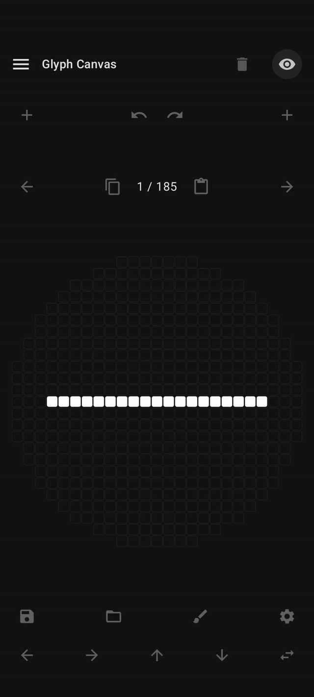
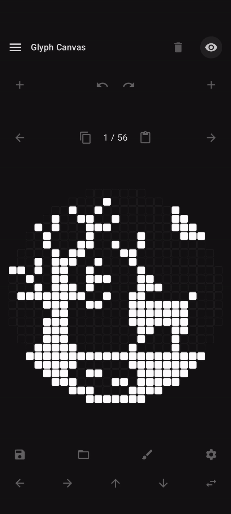
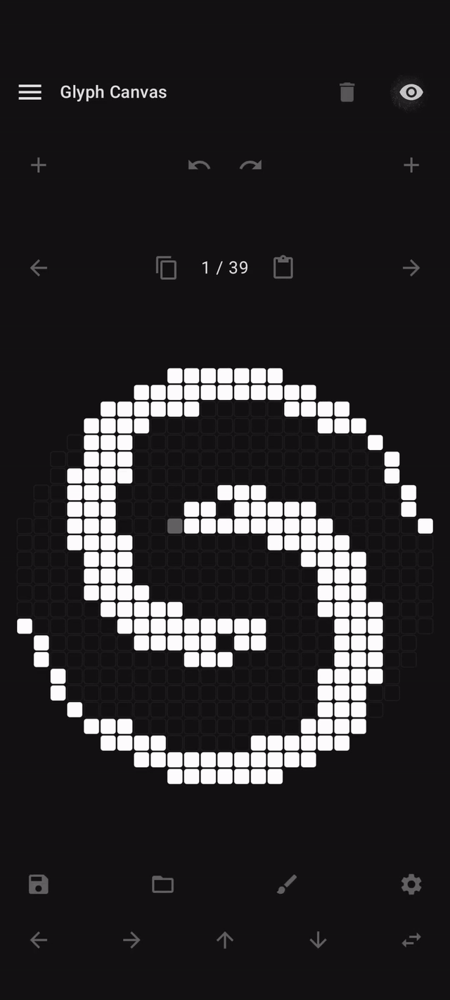
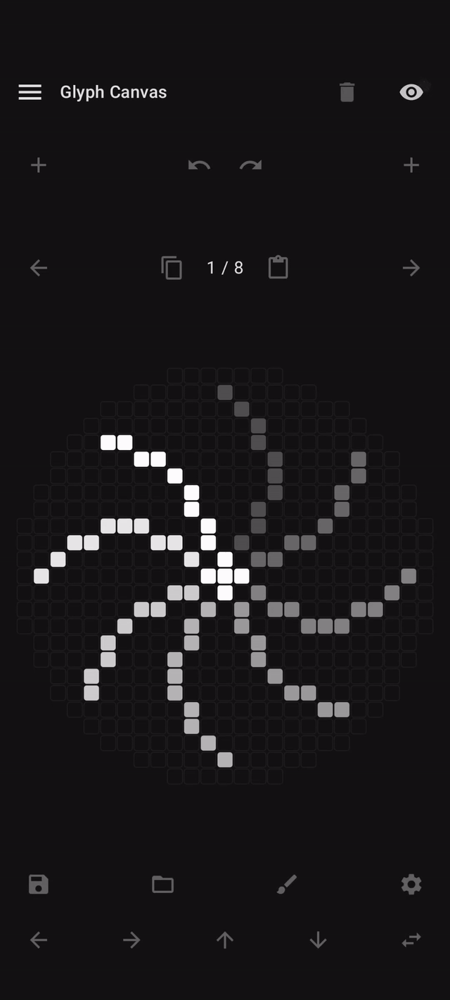
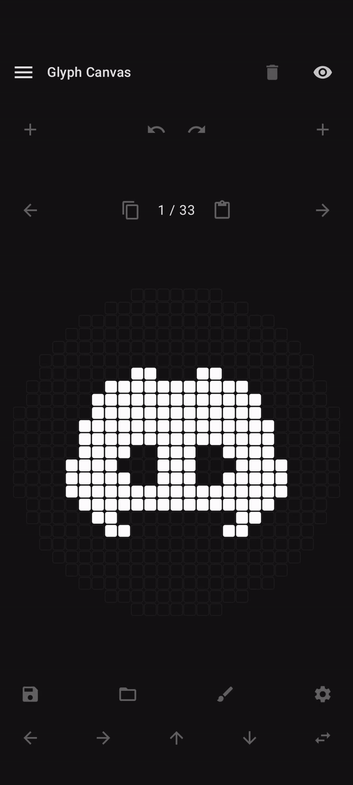
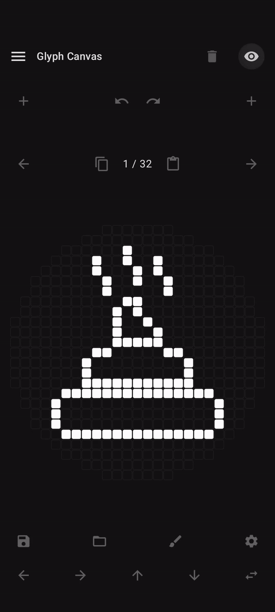
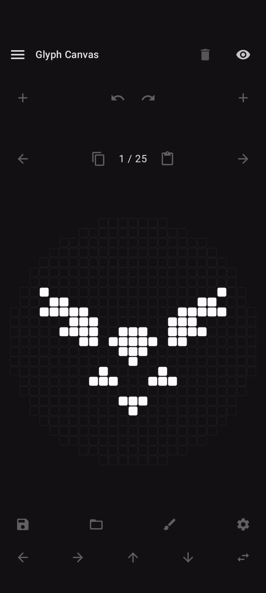
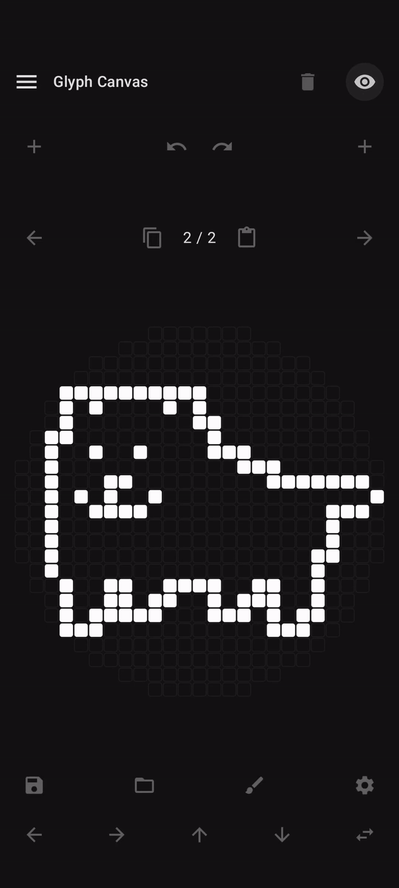
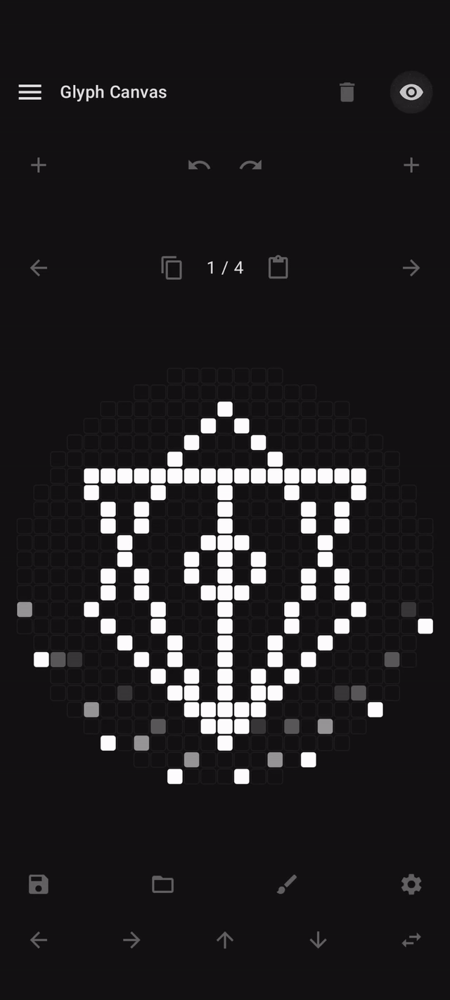

# Glyph Matrix Tools

Draw custom images and animations for the **Nothing Phone 3 Glyph Matrix**, then set them to appear:

- 🔓 When the phone screen is unlocked
- 🔔 When notifications arrive
- 📞 During calls

Glyphs can be further configured to appear only for certain **apps** and/or **contacts**.

## Preview

<table>
  <tr>
    <td></td>
    <td></td>
    <td></td>
  </tr>
  <tr>
    <td></td>
    <td></td>
    <td></td>
  </tr>
  <tr>
    <td></td>
    <td></td>
    <td></td>
  </tr>
</table>
